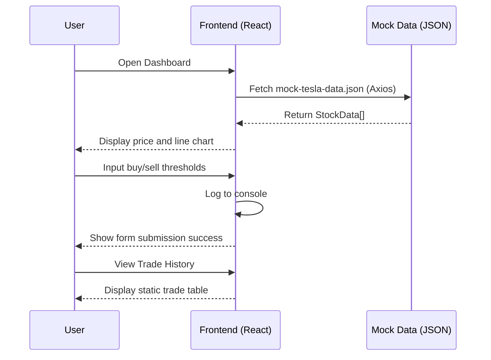

# Trading App: Sprint 0 Architecture Overview

This document outlines the architecture for Sprint 0 of the **Trading App**, a platform for automated Tesla stock trading. Sprint 0 focuses on building a responsive React TypeScript single-page application with mock data to simulate user interactions, laying the foundation for future backend integration and real-time trading. The architecture is designed for a 1–2 week development timeline, prioritizing functionality, type safety, and CV impact.

---

## Changelog (Initial Sprint)

- **Added**: React TypeScript project setup with Vite and Tailwind CSS.
- **Added**: Mock Tesla stock data with TypeScript interfaces for type safety.
- **Added**: UI components for dashboard, rule settings, and trade history.
- **Added**: Responsive design with Tailwind CSS and Chrome DevTools testing.
- **Added**: Git repository for version control.
- **Planned**: Backend API integration with broker sandbox (Sprint 1).

---

## Architecture Components

### 1. Frontend (React with TypeScript)

- **Purpose**: Deliver a responsive single-page application for user interaction with mock Tesla stock data.
- **Components**:
  - **Dashboard**: Displays current price and a line chart of price trends.
  - **Rule Settings**: Form for setting buy/sell thresholds (e.g., buy at £240, sell at £260).
  - **Trade History**: Table showing simulated trade details (timestamp, action, price, profit/loss).
  - **App Container**: Combines components in a responsive layout.
- **Tech**: React, TypeScript, Tailwind CSS, Axios, `chart.js`, `react-chartjs-2`.
- **Features**:
  - Mock data fetching with Axios for simulated Tesla stock prices.
  - Line chart visualization using `react-chartjs-2` for price trends.
  - Form input validation for buy/sell thresholds (console logging for now).
  - Responsive design with Tailwind CSS classes (e.g., `sm:`, `md:`).
- **Time Estimate**: 4–5 days.

### 2. Data Layer (Mock Data)

- **Purpose**: Simulate Tesla stock data for UI development and testing.
- **Components**:
  - **TypeScript Interface**: `StockData` (`timestamp`, `price`, `volume`) for type safety.
  - **Mock Data File**: JSON file (`mock-tesla-data.json`) with sample stock data.
  - **Data Fetching Utility**: Axios-based utility (`fetchMockData`) to load mock data.
- **Tech**: TypeScript, JSON, Axios.
- **Features**:
  - Type-safe data structures to prevent runtime errors.
  - Static JSON file for easy modification and testing.
  - Asynchronous data fetching to mimic future API calls.
- **Time Estimate**: 1–2 days.

### 3. Version Control

- **Purpose**: Track codebase changes and enable collaboration.
- **Setup**:
  - Initialized Git repository with `.gitignore` for `node_modules` and sensitive files.
  - Committed initial codebase and pushed to a remote repository (e.g., GitHub).
- **Tech**: Git, GitHub.
- **Features**:
  - Structured commit messages (e.g., “Add Dashboard component with mock data”).
  - `.gitignore` to exclude unnecessary files.
- **Time Estimate**: 0.5 days.

---

## Data Flow

1. **Mock Data Loading**:
   - Frontend (`Dashboard.tsx`) calls `fetchMockData` (Axios) to retrieve `mock-tesla-data.json`.
   - Data is parsed into `StockData[]` and stored in component state.
2. **Dashboard Display**:
   - Current price is extracted from the latest `StockData` entry.
   - Line chart is rendered with timestamps (x-axis) and prices (y-axis).
3. **Rule Settings**:
   - User inputs buy/sell thresholds in `RuleSettings.tsx`.
   - Form submission logs data to console (backend integration planned for Sprint 4).
4. **Trade History**:
   - `TradeHistory.tsx` renders a static array of simulated trades in a table.
   - Table columns include timestamp, action, price, and profit/loss.

---

## Architecture Diagram

The architecture is frontend-focused with mock data, laying the groundwork for future backend integration. Below is a PlantUML diagram.

```
@startuml class
skinparam monochrome true
skinparam defaultFontSize 14

class User as "User (Browser)"
class Frontend as "Frontend\n(React, TypeScript)\n- Dashboard\n- Rule Settings\n- Trade History"
class MockData as "Mock Data\n(JSON)\n- mock-tesla-data.json"

User -down-> Frontend : HTTP (Interact with UI)
Frontend <--> MockData : Axios (Fetch mock data)

note right of Frontend
  - Responsive UI with Tailwind CSS
  - TypeScript for type safety
  - Components: Dashboard, Rule Settings, Trade History
end note

note right of MockData
  - Static JSON with Tesla stock data
  - TypeScript interface: StockData
end note

@enduml
```


---

## Sequence Diagram

The sequence diagram illustrates the interaction between the user, frontend, and mock data layer, using Mermaid syntax.




---

## Development Plan (1–2 Weeks)

- **Week 1**:
  - **Day 1**: Set up React TypeScript project with Vite and Tailwind CSS.
  - **Day 2**: Create mock data (`mock-tesla-data.json`) and TypeScript interface (`StockData`).
  - **Day 3–4**: Build `Dashboard.tsx` with price display and line chart.
  - **Day 5**: Develop `RuleSettings.tsx` and `TradeHistory.tsx`.
- **Week 2**:
  - **Day 6**: Combine components in `App.tsx` and style with Tailwind CSS.
  - **Day 7**: Test responsiveness in Chrome DevTools (mobile and desktop).
  - **Day 8**: Initialize Git repository, commit, and push to remote.
  - **Buffer**: 1–2 days for debugging and refinements.

---

## Sprint 0 Requirements

- **Must-Have**:
  - React TypeScript project with Tailwind CSS.
  - Mock Tesla stock data with TypeScript interface.
  - Dashboard with price and line chart.
  - Rule settings form for buy/sell thresholds.
  - Trade history table with simulated trades.
  - Responsive design across mobile and desktop.
- **Nice-to-Have**:
  - Basic form input validation (e.g., positive numbers).
  - Additional mock data entries for testing.
- **Out of Scope**:
  - Backend API integration (planned for Sprint 4).
  - Real-time data fetching (planned for Sprint 2).

---

## CV Highlights

- **Technologies**: React, TypeScript, Tailwind CSS, Axios, `chart.js`, `react-chartjs-2`, Git.
- **Skills**: Frontend development, TypeScript type safety, responsive UI design, data visualization, version control.
- **Impact**: Built a responsive React TypeScript UI prototype for a 2025-trending automated trading app, demonstrating expertise in modern frontend development and type-safe architecture.
- **Documentation**: Created a comprehensive architectural document with diagrams, showcasing best practices for maintainability and stakeholder communication.

---

## Documentation Best Practices

- **Version Control**: Stored codebase in a Git repository with clear commit messages (e.g., “Add mock data and TypeScript interfaces”).
- **Changelog**: Included a changelog to document initial sprint features.
- **Clarity**: Used Markdown with PlantUML and Mermaid diagrams for stakeholder readability.
- **LinkedIn Post Idea**: “Kicked off my Trading App project with a responsive React TypeScript UI in Sprint 0, featuring mock Tesla stock data and type-safe design. Ready for backend integration! #React #TypeScript #FinTech”
